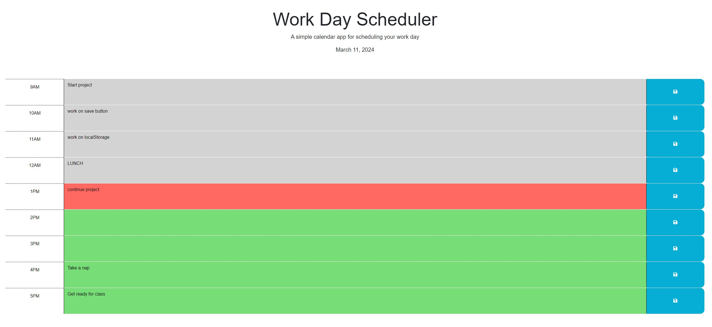

# CHALLENGE 5 WORK SCHEDULER

## DESCRIPTION
Are you unorganized? Do you have a lot of things planned during your work day, but always forget what time those plans are at? Fear not, I have created this project in which you can enter your agenda and plan out your work day. An average work day from 9am to 5pm. Within that timeframe, you can enter your schedule so that you will not forget what arrangments your have throughout your day. I was motivated to create this project because there are many times, that I forget what I have planned for the day, or what I have done throughout the day. Here is an easy day planner to keep you organized.

## HOW TO USE
To use this work day scheduler, all you need to do is click inside of the box of your desired hour. Then just enter what projects your have planned for that hour. Once you have entered what you have prepared for, you would then click the save button on the right for that specified hour. This planner will keep track of the current hour. If the planned hour has passed from the current hour, it will be marked gray. If it is currently on that hour, it will be marked red and if the planned hour has not passed yet, it will be marked green. Here is an example below:

## ACCEPTANCE CRITERIA
GIVEN I am using a daily planner to create a schedule\
WHEN I open the planner\
THEN the current day is displayed at the top of the calendar\
WHEN I scroll down\
THEN I am presented with time blocks for standard business hours of 9am to 5pm\
WHEN I view the time blocks for that day\
THEN each time block is color-coded to indicate whether it is in the past, present, or future\
WHEN I click into a time block\
THEN I can enter an event\
WHEN I click the save button for that time block\
THEN the text for that event is saved in local storage\
WHEN I refresh the page\
THEN the saved events persist

## VIEWING MY PROJECT
To view live page, open your browser (preferably Google Chrome), then enter <i>https://rapostoljr.github.io/challenge_5_work_day_scheduler/</i> in your address bar.

Link to Deployed Application: <i>https://github.com/rapostoljr/challenge_5_work_day_scheduler.git</i>